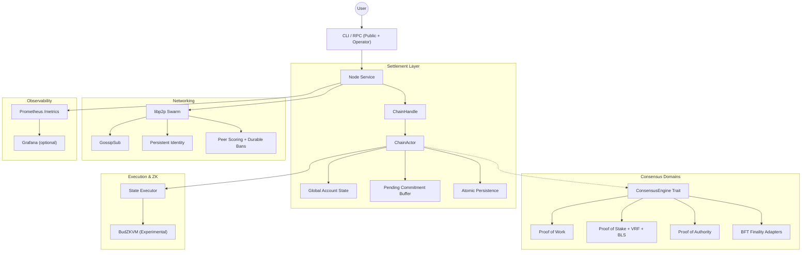

# ⚡ Budlum Core

> **A controlled public-devnet candidate for Layer-1 blockchain research: modular, deterministic, and multi-consensus native.**

[](https://github.com/rade/budlum-core)
[](https://github.com/rade/budlum-core)
[](https://opensource.org/licenses/MIT)
[](https://www.rust-lang.org/)

---

> [!CAUTION]
> **Controlled Public Devnet Candidate (v0.3-dev)**
>
> Budlum Core is suitable for controlled public devnet experiments with clear risk disclaimers. It is **NOT** audited mainnet software, has not completed professional security review, and should **NOT** be used for financial transactions or production applications carrying real value.

---

Budlum Core is a Rust-based Layer-1 blockchain framework designed for engineers and protocol researchers who want to explore modular consensus, deterministic state settlement, and cross-domain interoperability.

If this project helps your research, please support it:
⭐ **Star the repo** | 🍴 **Fork it** | 🧠 **Open a discussion**

---

## 🏗️ Architectural Vision

Most blockchain frameworks are optimized for a single consensus worldview. Budlum is designed as a **Universal Settlement Layer** to research how heterogeneous networks (PoW, PoS, BFT) can achieve deterministic state convergence without centralized intermediaries.

### Why Budlum?
- 🔁 **Heterogeneous Settlement**: Infrastructure for running parallel consensus domains (PoW, PoS, BFT) on a unified settlement layer.
- 🌉 **Verified Trustless Interop**: Experimental bridge flow where lock, mint, burn, and unlock are tied to committed domain events and Merkle proofs.
- 🧠 **Deterministic Execution**: Research into replay-safe state transitions and consistent global headers.
- 🧩 **Modular Core**: Decoupled consensus, networking, and execution layers for rapid prototyping.
- 🌐 **P2P Native**: Built on `libp2p` with GossipSub, persistent identity, DNS seed resolution, and durable peer banning.
- 🛡️ **BLS Finality**: Two-phase BLS-signed prevote/precommit protocol with aggregated signature verification and auto-precommit.
- 🩺 **Dual RPC**: Separate public and operator JSON-RPC 2.0 listeners with health endpoints, per-IP rate limiting, and trusted-proxy enforcement.
- 📦 **Deployment Ready**: Docker multi-stage image, docker-compose 4-node devnet, systemd unit, and Prometheus metrics collectors.
- 🛠️ **Developer First**: Book-style technical documentation, JSON-RPC reference material, and a growing adversarial test suite.

---

## 🏗️ Architecture Overview



---

## 🧩 Devnet Candidate Features (v0.3)

### 🌍 Multi-Consensus Settlement (Model B)
- **Verified-Only Commitments**: RPC paths reject raw domain commitments; settlement updates must arrive as `VerifiedDomainCommitment` with a matching finality proof hash.
- **Adapter Hardening (all real verification)**: PoW binds the proof to the commitment block hash and checks confirmation depth plus internally-consistent declared cumulative work (not a self-reported number); PoS and BFT both cryptographically verify a real BLS commit certificate against the validator snapshot and registered validator-set hash; ZK finality resolves through the STARK-verified `ProofClaimRegistry`; PoA verifies real ed25519 signatures from the approved authority set (count-based quorum, bound to the commitment) — using its own stake-free authority model, keeping it fully isolated from the permissionless stake registry.
- **Parent-Linked Domain History**: Rejects commitments whose `parent_domain_block_hash` does not link to the last committed domain block.
- **Strict Nonce Invariant**: Stale or equal nonce updates are rejected before durable insertion.
- **Byzantine Resilience**: Global state convergence verified via an 18-test "Chaos Matrix" under simulated partitions and delays.
- **Equivocation Immunity**: Protocol-level detection and global freezing of conflicting domains; duplicate commitments remain idempotent.
- **Atomic Settlement Persistence**: Commitment insertions and domain height/hash updates persisted in one storage batch.

### 🔥 $BUD Tokenomics
- **Fixed Supply**: 100,000,000 $BUD, 6 decimals (`src/tokenomics/mod.rs`). No `total_supply` field — supply is the sum of all balances; there is no inflation mint on the burn paths.
- **Genesis Distribution**: Community 10M / Liquidity 10M / Ecosystem 20M / Team 20M / Burn Reserve 40M (config-driven `TokenomicsParams`, validated to sum to exactly 100M). Wired into genesis via the opt-in `GenesisConfig::with_bud_tokenomics()` (default genesis is unchanged).
- **Team Vesting (enforced)**: standard cliff + linear schedule; transfers from the team account are rejected (`vesting_locked`) if they would spend below the still-locked portion.
- **Timed Reserve Burn**: time-triggered (epoch-based, not usage-based) annual burn of the 40M reserve, fired automatically at each epoch transition (`advance_epoch`); strictly reduces supply, never offset by a mint.
- **Metabolic Burn**: a configurable fraction of every transaction fee is burned instead of paid to the block producer (in `Executor::apply_block`).
- *Out of scope (future work): PoSV consensus, $LUM token, launchpad/presale.*

### 🔓 Permissionless Participation Registry
- **No Whitelist / No Approval**: Validator, verifier and relayer participation is open — the only requirement is bonding stake (`src/registry/permissionless.rs`). Security is stake + slashing, never permission.
- **Staking == Registration**: Applying a `Stake` transaction automatically registers the account in the registry; there is no separate registration step (`Executor` + `AccountState::sync_validator_registration`).
- **Generic, Extensible Roles**: Roles are an open `RoleId` (not a hard-coded enum), so future application layers can define new roles without changing the registry.
- **Config/Governance Parameters**: Minimum stake, unbonding window and per-offence slash ratios are `RegistryParams` — tunable, not hard-coded (`src/registry/params.rs`).
- **Canonical Slashing Evidence**: A single `SlashingReport` format (`src/registry/evidence.rs`) is shared by consensus, RPC and other domains. Only consensus-verified reports are actioned; externally-submitted unverified reports never cause a slash.
- **Relayer-Gated Cross-Domain Messaging**: Relayed `CrossDomainMessage` submission (RPC + p2p) requires the sender to be an active relayer in the registry (active or unbonding, not slashed); system-generated bridge events bypass the gate. No whitelist — registration is by bonding stake (`bud_registryBondRelayer`).
- **Anti-Spam Fee for Slashing Reports**: `bud_submitSlashingReport` charges a small `RegistryParams::slashing_report_fee` (default 10) to the reporter — refunded when the report is actionable (honest accusers are never penalised), burned otherwise. The endpoint stays permissionless (anyone who pays can submit) while mass spam becomes economically costly and sybil-resistant.
- **Automatic Liveness Slashing**: `LivenessTracker` (`src/registry/liveness.rs`) counts consecutive missed-participation epochs per validator; crossing `liveness_max_missed_epochs` (default 10) emits a consensus-verified liveness report routed through the existing slash flow. Counter resets on participation (consecutive, not cumulative).
- **Permissionless ZK Prover Bridge**: Anyone may submit a BudZKVM proof via the shared `CrossDomainMessage` primitive (`src/prover/mod.rs`); no registration is required because STARK proofs are self-verifying (`budlum-core` verifies natively via `bud_proof`). A small `proof_submission_fee` (default 10) is refunded on a valid proof and burned on an invalid one. Registering as a `PROVER` (`bud_registryBondProver`) is optional and only grants reward eligibility (`prover_reward`, default 50). "First valid wins" per `(domain, height)`: identical re-submissions are idempotent, conflicting state roots are rejected. RPC: `bud_submitZkProof`.
- **Isolated PoA Membership**: The permissioned PoA domain uses a completely separate KYC/approval-gated registry (`src/registry/poa_membership.rs`); its rules cannot leak into PoW/PoS/BFT and stake never grants PoA authority.
- **RPC**: `bud_registryRegister`, `bud_registryBondRelayer`, `bud_registryBondProver`, `bud_submitZkProof`, `bud_registryQuery`, `bud_registryActiveMembers`, `bud_submitSlashingReport` — all permissionless (no whitelist/approval gate).

### 🌉 Verified Cross-Domain Bridge
- **Bridge-Enabled Domains Only**: Asset registration requires active, registered, bridge-enabled domains.
- **Safe Lock Constraints**: Source/target domains must differ, transfer amount must be non-zero.
- **Raw Burn/Unlock Disabled**: Direct bridge burn and unlock calls rejected.
- **Proof-Based Return Path**: Funds return only after target-domain `BridgeBurned` event is committed and verified.

### 🛡️ BLS Finality Protocol (v0.3)
- **`BlsKeypair`**: BLS12-381 keypair integrated into `ValidatorKeys` with `sign_bls()` / `verify_bls_sig()` primitives.
- **Signed Votes**: Validators produce BLS-signed prevote/precommit messages via `ConsensusEngine::bls_secret_key()`.
- **Auto-Precommit**: Periodic loop detects prevote quorum and automatically signs + broadcasts precommit.
- **Aggregate Verification**: `FinalityCert` verified with BLS pairing: `e(sig, G2_gen) == e(H(msg), agg_pk)`.
- **Adversarial Tests**: Byzantine equivocation rejection, tampered aggregate signature detection, full 4-validator flow.

### ⚡ RPC Hardening (v0.3)
- **Dual Listeners**: Separate public and operator HTTP servers.
- **Trusted Proxy**: Only configured proxy IPs may set `X-Forwarded-For` for client identification.
- **Per-IP Rate Limiting**: Independent token buckets per client IP, 60-second sliding window.
- **Health Endpoints**: `bud_health` (status/height/peers) and `bud_nodeInfo` (chainId/peerId/rpcMode).
- **Body/Connection Limits**: Public 10MB/500 conn, Operator 50MB/10 conn.

### 🌐 P2P Hardening (v0.3)
- **Persistent Identity**: `load_or_generate_identity_key()` — P2P keypair survives restarts.
- **Durable Peer Bans**: JSON-persisted bans reloaded on startup, saved every 5 minutes.
- **mDNS Policy**: Per-network (`mainnet`/`testnet` off, `devnet` on).
- **DNS Seed Resolution**: `resolve_dns_seeds()` resolves hostnames to multiaddrs at startup.

### 💾 Snapshot V2 (v0.3)
- **Canonical V2 Format**: `StateSnapshotV2` with full consensus metadata (epoch, base_fee, block_reward, unbonding_queue, cross-domain roots, finality certs).
- **Replay Equivalence**: `AccountState::from_snapshot_v2()` preserves all consensus state; state root matches original.
- **Chunk-Session Binding**: `session_id` in `SnapshotChunk` prevents cross-peer chunk mixing.
- **V2-First Restore**: Startup tries V2 snapshot, falls back to V1.

### 📊 Observability (v0.3)
- **Prometheus**: Live collectors for chain height, finalized height, blocks produced, transactions, reorgs, mempool size/evictions/cleanups, P2P messages/peers.
- **Docker**: Multi-stage Debian image, 4-node `docker-compose` with Prometheus.
- **systemd**: Production unit file with sandboxing and restart policy.
- **Fuzzing**: 4 `cargo-fuzz` targets (block, transaction, snapshot, consensus header).

---

## 🧪 Verification & Test Coverage

- **Total Tests**: `332` (All passing ✅)
- **Byzantine Chaos Matrix**: 18 scenarios covering network partitions, duplication, out-of-order delivery, and domain equivocation.
- **BLS Finality Tests**: 12 tests for sign/verify, aggregator flow, byzantine equivocation, certificate tampering, replay equivalence.
- **RPC Security Tests**: Auth, CORS, IP filtering, per-IP rate limiting, trusted proxy, operator defaults.
- **P2P Hardening Tests**: Persistent identity, durable ban roundtrip, DNS seed resolution.
- **Snapshot V2 Tests**: V2 metadata preservation, replay equivalence, serialization roundtrip, PruningManager V2 save/load.
- **Metrics Tests**: Chain metrics emit, counter increments, encoding format.
- **Distributed Devnet Simulation**: Gossip convergence across a 5-node `libp2p` mesh.

To run the full suite:
```bash
nix develop --command cargo test --workspace
```

To run fuzz targets:
```bash
cd fuzz && cargo fuzz run block_deserialize
```

---

## 🔒 Production Hardening Status

**v0.3-dev** closes 5 of 7 Mainnet blockers. Remaining work: external security audit, archive-node policy, migration framework, and production runbooks.

Read the book's [**Production Hardening Status**](docs/en/book/ch12_production_hardening.md) for the full implementation matrix.

---

## ⚡ Quick Start

### Requirements
- Rust `1.94.0`, `protoc`, sibling checkout of [BudZKVM](https://github.com/Budlum/BudZKVM)

### Build
```bash
git clone https://github.com/Budlum/BudZKVM.git
git clone https://github.com/rade/budlum-core.git infra
cd infra
cargo build --release
```

### Run a Devnet Node
```bash
# Proof of Work
./target/release/budlum-core --consensus pow --difficulty 3 --port 4001

# Proof of Stake
./target/release/budlum-core --consensus pos --min-stake 5000 --db-path ./data/pos_node
```

### Docker 4-node Devnet
```bash
docker compose up -d
curl -X POST -H "Content-Type: application/json" \
  --data '{"jsonrpc":"2.0","method":"bud_blockNumber","params":[],"id":1}' \
  http://localhost:8545
```

### RPC Usage
```bash
# Health check
curl -X POST -H "Content-Type: application/json" \
  --data '{"jsonrpc":"2.0","method":"bud_health","params":[],"id":1}' \
  http://localhost:8545

# Block height
curl -X POST -H "Content-Type: application/json" \
  --data '{"jsonrpc":"2.0","method":"bud_blockNumber","params":[],"id":1}' \
  http://localhost:8545
```

See the [**Protocol Specification**](SPECIFICATION.md) for the full API reference.

---

## 🗺️ Research Roadmap

- [x] **Devnet Economic Hardening**: Validator reward distribution and slashing execution.
- [x] **Settlement Atomicity**: Atomic commitment + domain height/hash persistence.
- [x] **Verified Settlement Hardening**: Proof-gated commitments, parent-link checks, strict nonce.
- [x] **Verified Bridge Return Path**: Bridge unlock requires committed target-domain burn event proof.
- [x] **Sync Hardening**: Handshake-triggered headers-first sync.
- [x] **PKCS#11 HSM Signer**: `ConsensusSigner` trait, `Pkcs11Signer`, `KeyPairSigner`.
- [x] **BLS Finality Protocol**: `BlsKeypair`, signed prevote/precommit, auto-precommit, 12 tests.
- [x] **RPC Dual Listener**: Public/operator servers, trusted proxies, health endpoints, per-IP rate limiting.
- [x] **P2P Hardening**: Persistent identity, durable bans, mDNS policy, DNS seeds.
- [x] **Snapshot V2**: Canonical V2 restore, replay equivalence, chunk-session binding.
- [x] **Observability**: Prometheus live collectors, Metrics wiring.
- [x] **Deployment**: Docker image, docker-compose, systemd unit, fuzz targets.
- [ ] **ZKVM Optimizations**: Improving STARK proof generation performance.
- [ ] **Formal Verification**: Researching TLA+ models for settlement convergence.
- [ ] **External Audit**: Professional security review.
- [ ] **Privacy Layer**: Exploring Monero/Zcash-style privacy primitives.
- [ ] **AI Execution Layer**: Investigating AI-assisted protocol automation.

Budlum is built for protocol researchers and developers who like looking under the hood. We welcome technical reviews, protocol design discussions, and security feedback.

## 🚫 What This Repo Does *Not* Do (Scope Boundaries)

To prevent scope creep, `budlum-core` deliberately excludes the following:

- **No whitelist / admin-approval / central gate** for validator, verifier or
  relayer roles on the PoW/PoS/BFT domains. Participation is **permissionless**:
  the only requirement is bonding stake (see `src/registry/permissionless.rs`).
  Security comes from stake + slashing, never from permission.
- **No fixed or committee-based relayer set.** Anyone can become a relayer by
  staking; there is no hard-coded relayer list.
- **The permissioned PoA domain is an isolated exception, not the norm.** PoA
  membership (`src/registry/poa_membership.rs`) is KYC/approval-gated and kept in
  a *completely separate* data structure from the permissionless registry. PoA's
  admission rules must not leak into other domains, and stake must not grant PoA
  authority. This isolation is enforced by `src/tests/permissionless.rs`.
- **No application-layer logic** (DeEd, SocialFi, B.U.D., Budlum Go, DeArt,
  participation-bank product). This repo is the network / L1 core only.
- **No bespoke L1↔ZKVM bridge protocol.** Cross-domain interaction with BudZKVM
  goes through the existing `CrossDomainMessage` primitive.

## 🤝 Join the Research

### How to Contribute:
1. ⭐ **Star the Repository**: It helps other researchers find our work.
2. 🍴 **Fork & Experiment**: Try building a custom `ConsensusKind`!
3. 🧠 **Open a Discussion**: Have an idea for the Privacy Layer or AI Execution?
4. 🐛 **Report Bugs**: Use GitHub Issues for any technical anomalies.

Read [`CONTRIBUTING.md`](CONTRIBUTING.md) before participating. For security-sensitive reports, please use [`SECURITY.md`](SECURITY.md).

---

## 📄 License

MIT License. Copyright (c) 2026 The Budlum Developers.
